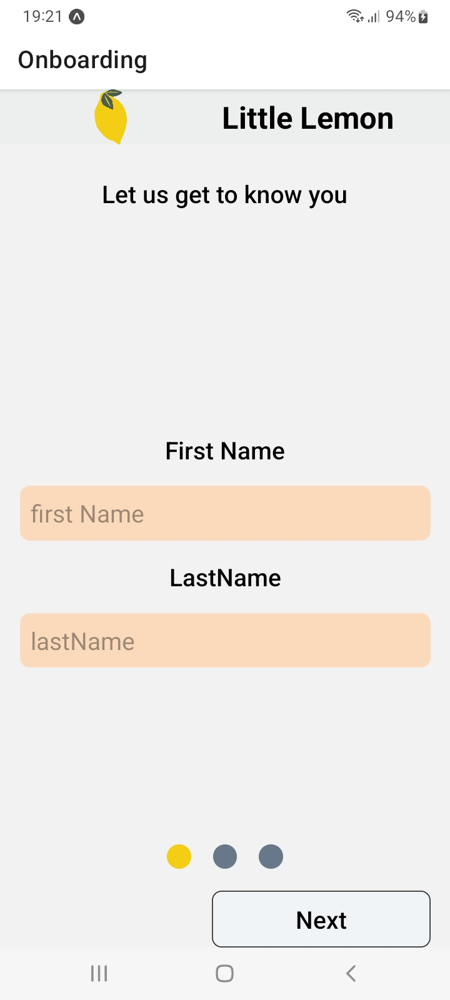
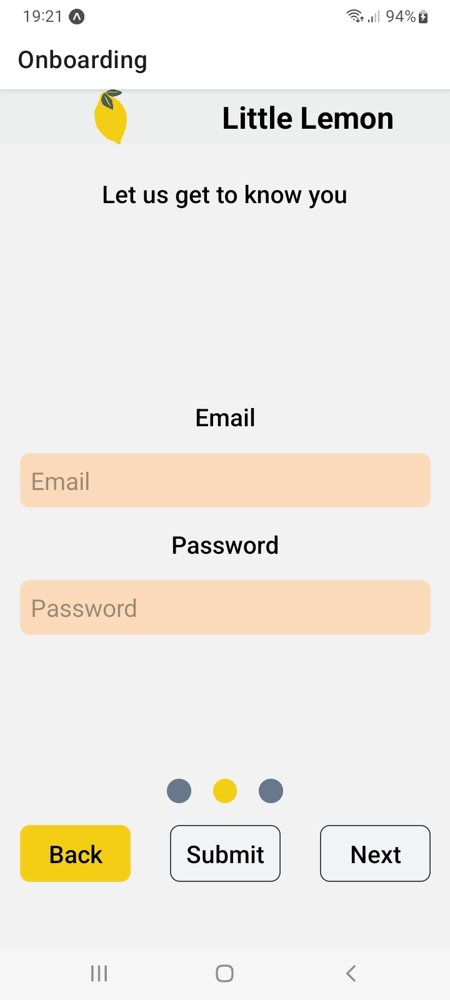
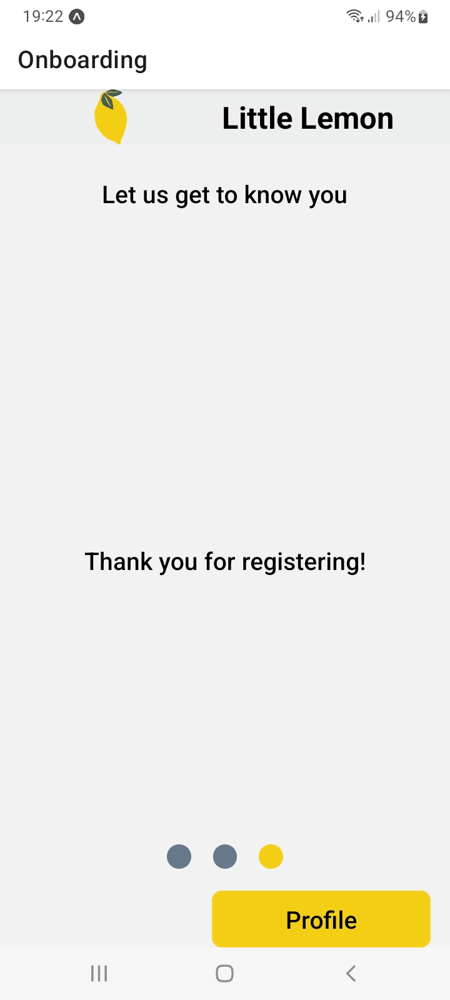
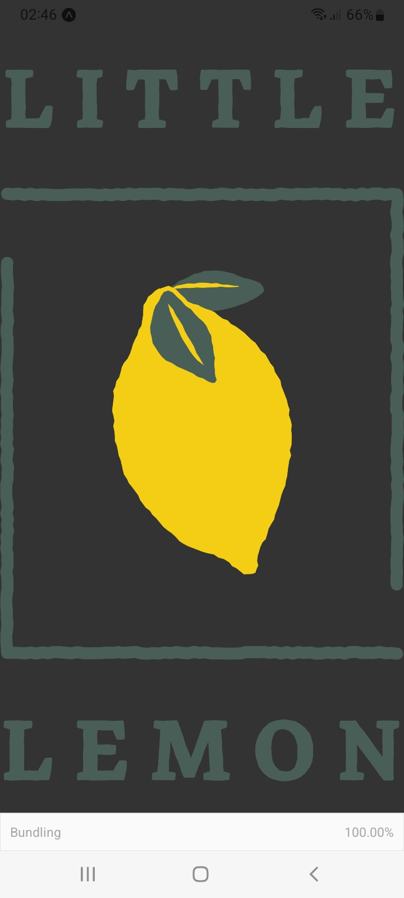
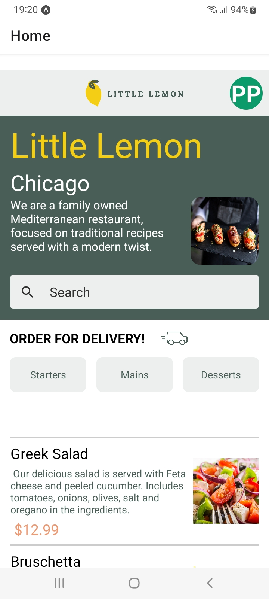
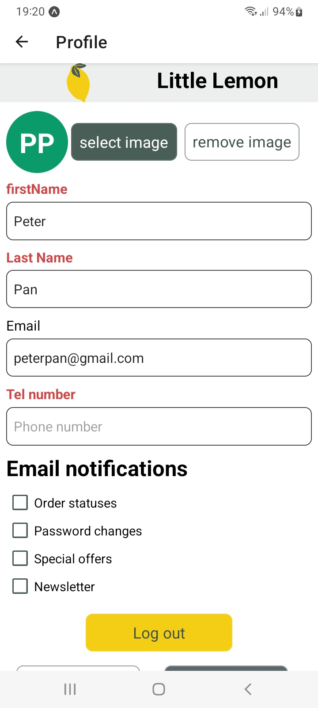
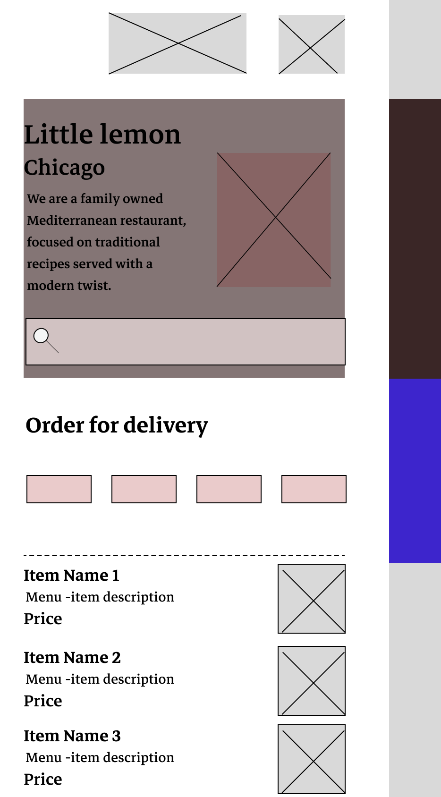

# Littlelemon Mobile App

## Overview
This application is a food ordering app for a fictional restaurant named littlelemon. It consists of a
splash screen which users see whenever the app is loading, user registration screens, a user profile screen
and a Home screen.

This application was created using the following technologies
* React Native
* React
* Expo Platform

## Description
Users of the app on first opening the app are presented with an onboarding screen where they
have to complete a registration phase. After successful completion of this phase, they are then
presented with the Home Screen or they can choose to go to the Profile page, where they can see
all of their relevant information.

The profile screen also contains an avatar icon, clicking on the
icon opens up the user's phone camera image galleries and they can set any photo of their choice as
their icon. The profile screen also contains four checkboxes, which allows the user to enable or disable
email notifications, newsletters, password changes and special offers.

The UI elements of the Home Screen include a header featuring the LittleLemon Logo and an avatar(clicking on the avatar icon takes the user to the profile screen), a hero section featuring some text and an image as well as a search bar and a section displaying the special offers of the day. In this section users are able to quickly filter through the offers and select what they want.

## Usage
* Clone the project
* Run the following commands npm install and npm start
* A QR code will appear on your terminal
* Scan the code with expo go app(available on both IOS and Android)
* You will then be able to observe the functionality and design of the app

### Screenshots

    
    
    

    
    
    

### Credits
* [Guidiance from the Meta React Native Specialization offerred on Coursera:](https://www.coursera.org/specializations/meta-react-native?)

### App Wireframe

